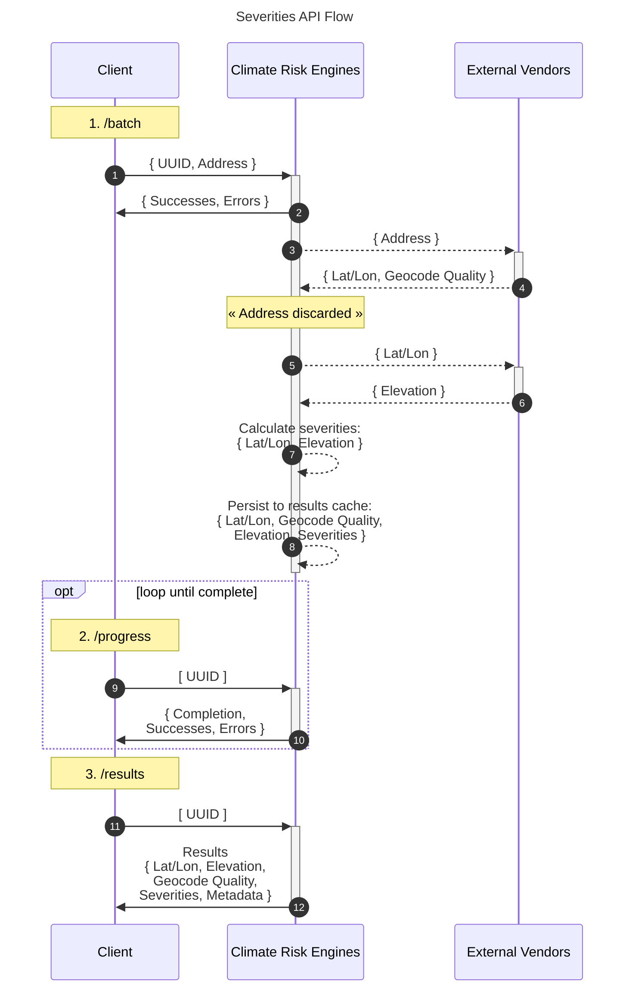

# Overview

XDI's APIs provide Physical Climate Risk analysis and offer two main interaction patterns:

- Synchronous (Single Location): Immediate response for individual locations
- Asynchronous (Batch): Process multiple locations in the background

# Usage Comparison

## Synchronous API

- Best for: Interactive applications, single location lookups
- Advantage: Immediate response
- Limitation: One location per request

## Batch API

- Best for: Large datasets, bulk processing
- Advantage: Process many locations efficiently
- Limitation: Results not immediate

# API Flows

## Synchronous (Single Location)

Client -> API: Send location details
API -> Client: Immediate response with severity data

[//]: # "Consider generalising severity data to physical climate risk data"

## Batch (Multiple Locations) Three-step process:

1. Upload (/batch)
   Client -> API: Submit locations in JSON Lines format
   API -> Client: Confirmation with success/error counts

2. Progress (/progress)
   Client -> API: Check status with location IDs
   API -> Client: Completion percentage, success/error counts

3. Results (/results)
   Client -> API: Request results with location IDs
   API -> Client: Complete results in JSON Lines format

Security Note: The API uses UUIDv4 identifiers to ensure non-correlation between results, enhancing data privacy.

For detailed request/response schemas, refer to the OpenAPI specification.

# Getting Started
## API Key
For an api key, reach out to API_Support@theclimateriskgroup.com

For functional testing you will receive a key to relevant Quality Assurance (QA) APIs. 

## About QA APIs
QA APIs do not have performance or uptime SLAs, however QA APIs have the same or very similar surface area as our Production (PROD) APIs. 

QA APIs are also used for XDI functional testing. 

When functional testing is complete you will migrate to PROD API for performance testing. 

## API documentation
API documentation is at https://api.climaterisk.qa/index.html

## Whitelisting
Please have the following domain whitelisted for functional development against our QA APIs:
- api.climaterisk.qa

And when you move performance testing against our PROD APIs,: 
- api.climaterisk.net 

# Structural Analysis APIs  

## About 
Simple Structural Residential APIs (SSR) and Simple Structural Commercial APIs (SSC) APIs. 
SSR and SSC APIs follow the same format. 

SRR is presented here as an example with links. 

SSC APIs follows the same pattern as SSR APIs. See <em>API Flows</em>. 

Comprehensive Structural (CS) Results does not follow the pattern of SSC and SSR. See <em>About Comprehensive Structural (CS) Results API</em>.

## Single SSR - synchronous

### v1/structural/simple/residential: 

- https://api.climaterisk.qa/index.html#operation/apis_simple_residential

## Batch SSR API endpoints - asynchronous

### Batch variant of /v1/structural/simple/residential

- https://api.climaterisk.qa/index.html#operation/batch_endpoints_simple_residential_batch

### Progress for /v1/structural/simple/residential/batch
- https://api.climaterisk.qa/index.html#operation/batch_endpoints_simple_residential_batch

### Results for /v1/structural/simple/residential/batch

- https://api.climaterisk.qa/index.html#operation/results_endpoints_simple_residential_results

See https://api.climaterisk.qa/.

## About Comprehensive Structural (CS) Results API
CS is a results-only endpoint. 

Using the CS Results API, you can retrieve additional information from assets made during a a SSC or SSR Batch variant request.

### Results for /v1/structural/comprehensive/batch
- https://api.climaterisk.qa/index.html#operation/results_endpoints_comprehensive_results

