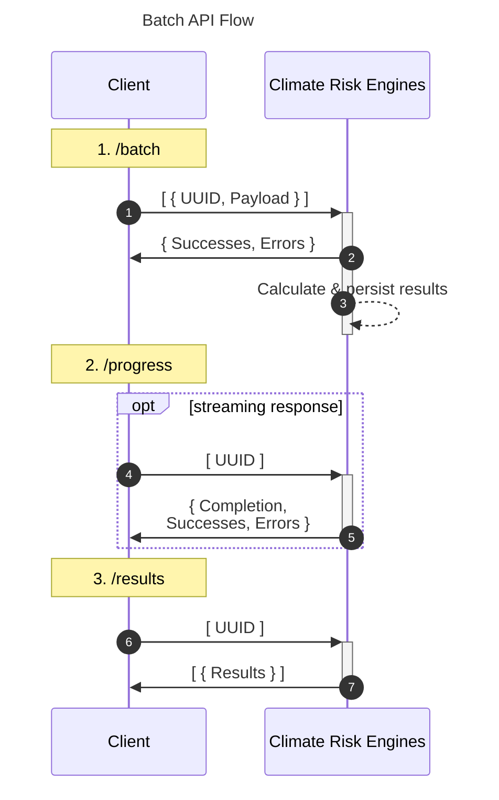
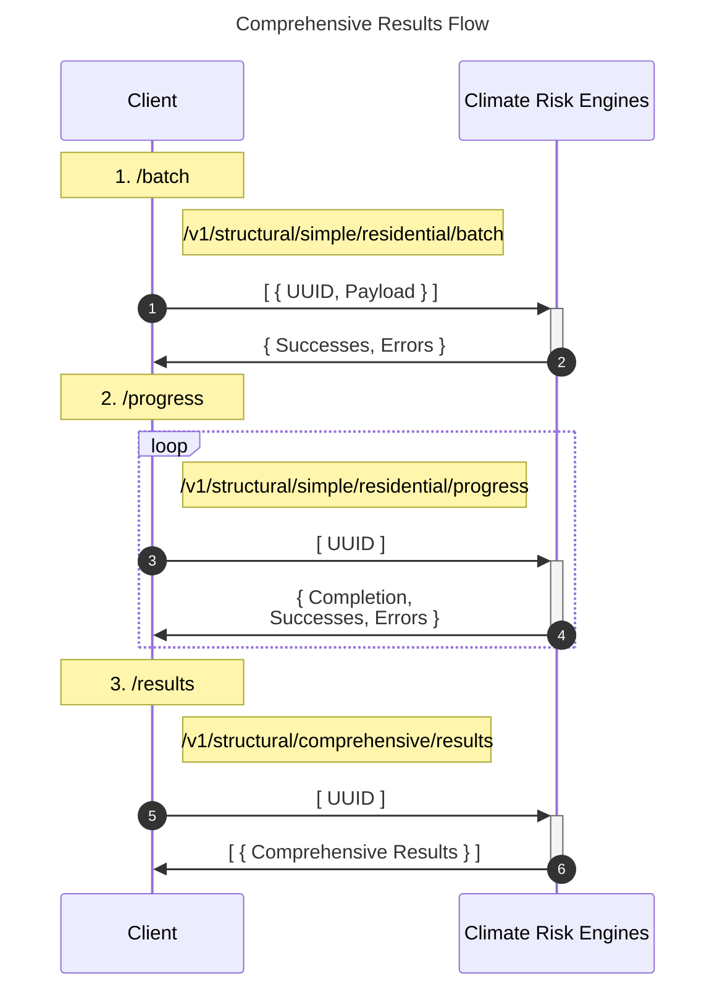

# Overview

XDI's APIs provide Physical Climate Risk analysis and offer two main interaction patterns:

- Single Location: Immediate response for individual locations
- Multi-Location (Batch): Process multiple locations in the background

# Usage Comparison

## Single

- Best for: Interactive applications, single location lookups
- Advantage: Immediate response
- Limitation: One location per request

## Batch

- Best for: Large datasets, bulk processing
- Advantage: Process many locations efficiently
- Limitation: Results not immediate

# API Flows

## Single

Client -> API: Send location details  
API -> Client: Immediate response with analysis results

## Batch :

1. Upload (`/batch`)
   Client -> API: Submit locations in JSON Lines format  
   API -> Client: Confirmation with success/error counts

2. Progress (`/progress`)
   Client -> API: Check status with location IDs  
   API -> Client: Completion percentage, success/error counts

3. Results (`/results`)
   Client -> API: Request results with location IDs  
   API -> Client: Complete results in JSON Lines format

Security Note: The API uses UUIDv4 identifiers to ensure non-correlation between results, enhancing data privacy.

For detailed request/response schemas, refer to [the OpenAPI specification](https://api.climaterisk.net/).

# Getting Started
## API Key
For an api key, reach out to api_support@theclimateriskgroup.com

For integration you will receive a key to the relevant Quality Assurance (QA) environment APIs, using the `climaterisk.qa` domain. For ongoing access, you will need to switch over to the production environment, using the `climaterisk.net` domain.

## Environments
The QA Environment does not have a performance or uptime SLA, however is it almost identical to our Production Environment.  Both environments are ISO27001 compliant, but the QA environment should only ever receive ***testing*** data.

## API Specification
- QA environment API documentation: [api.climaterisk.qa](https://api.climaterisk.qa/)
- Production environment API documentation: [api.climaterisk.net](https://api.climaterisk.net/)

# Structural Analysis APIs

Our structural analysis APIs come in two flavours: Simple & Comprehensive.  The analysis pathways are the same, the difference is in the detail-level of the outputs.
- Simple outputs are MVAR-based risk ratings for 6 time steps under all RCP scenarios.
- Comprehensive outputs provide damage (MVAR), Failure Probability (FP), and Productivity Loss (PL) metrics for the asset in total & broken down by hazard, for every 5 years under all RCP scenarios.

NB: Comprehensive outputs are only available via the Batch API flow at this time.

Additionally, to support clarity of use case, the structural APIs are split into residential and commercial variants, which enable different archetypes, but are otherwise the same shape/format.

## Simple Structural

- Simple Structural Residential (SSR) provides the **residential** archetypes.  For the current list of residential archetypes, consult [the archetype enum in the SSR Spec](https://api.climaterisk.qa/index.html#operation/apis_simple_residential)
- Simple Structural Commercial (SSC) provides the **commercial** archetypes.  For the current list of commercial archetypes, consult [the archetype enum in the SSC Spec](https://api.climaterisk.qa/index.html#operation/apis_simple_commercial)

The results endpoints for these APIs will return our Simple analysis outputs.

## Comprehensive Structural

For Comprehensive analysis metric outputs, the inputs need to be sent via either of the Simple Structural APIs.  Once processing has been completed, the results can be requested in either format.

To confirm, this is the process to obtain to Comprehensive Structural results for a Residential archetype:

