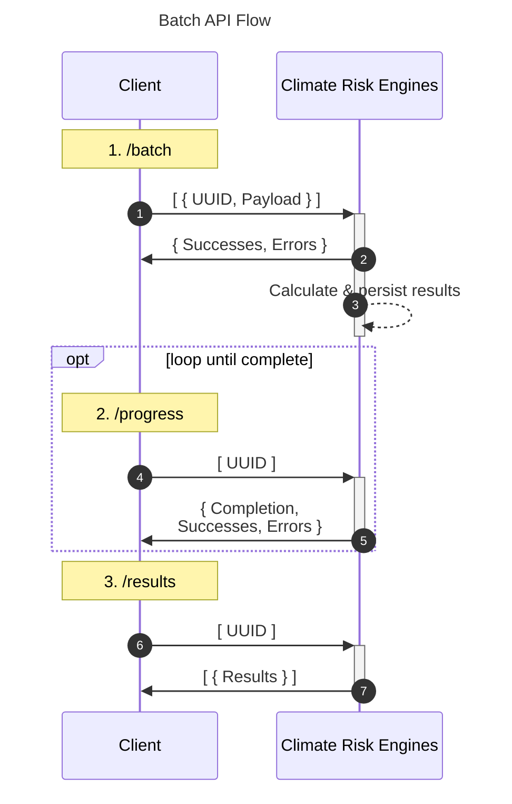

# Overview

XDI's APIs provide Physical Climate Risk analysis and offer two main interaction patterns:

- Synchronous (Single Location): Immediate response for individual locations
- Asynchronous (Batch): Process multiple locations in the background

# Usage Comparison

## Synchronous API

- Best for: Interactive applications, single location lookups
- Advantage: Immediate response
- Limitation: One location per request

## Batch API

- Best for: Large datasets, bulk processing
- Advantage: Process many locations efficiently
- Limitation: Results not immediate

# API Flows

## Synchronous (Single Location)

Client -> API: Send location details  
API -> Client: Immediate response with severity data

## Batch (Multiple Locations) Three-step process:

1. Upload (/batch)
   Client -> API: Submit locations in JSON Lines format
   API -> Client: Confirmation with success/error counts

2. Progress (/progress)
   Client -> API: Check status with location IDs
   API -> Client: Completion percentage, success/error counts

3. Results (/results)
   Client -> API: Request results with location IDs
   API -> Client: Complete results in JSON Lines format

Security Note: The API uses UUIDv4 identifiers to ensure non-correlation between results, enhancing data privacy.

For detailed request/response schemas, refer to the OpenAPI specification.
